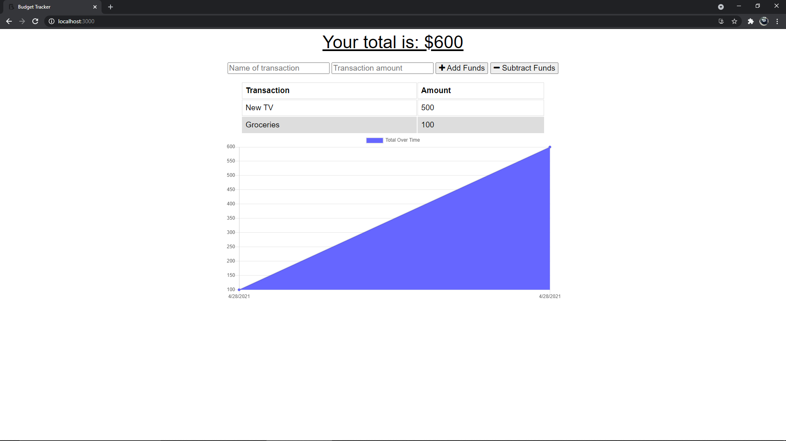
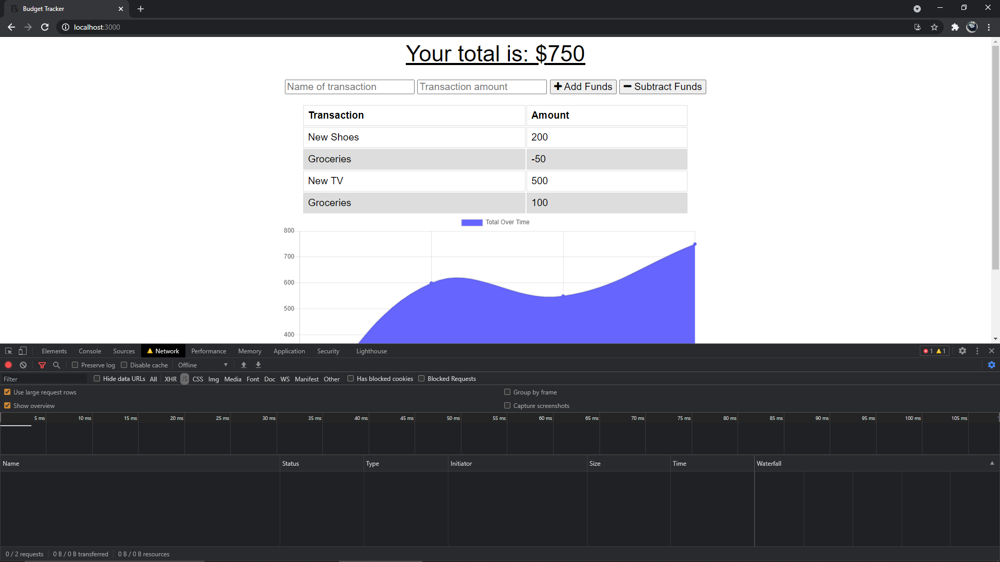

# Budget Tracker

## Description

- This application is a fully functioning budget tracker that allows you to to add and subtract expenses on and offline. 
 
- If the internet or network for some reason goes out then the user has the ability to see post that he or she has already create along with adding more, this is all because of IndexedDB.

- Since there is a IndexedDB in place the the application does not need the local MongoDB database to save data that the user has posted. Instead the data that has been posted is stored in the 
IndexedDB on the DOM so when the internet connection comes back online the user post is still there.

- The user has the opportunity to add and subtract items that are updated on a graph provided by graph.js. 

- With all of these features combined the user has a fully functioning budget tracker off and online. 

## Screenshots

Home Page

Offline POST

Offline POST saved online

## Installation

To check the project, I worked on click on these links: 

GitHub: https://github.com/NBP77/budget-tracker

Deployed app: https://ancient-crag-04272.herokuapp.com/ 

## Usage

- Both back and front end databases with IndexedDB and MongoDB 

- User can post data offline and see it when it comes back online  

- Chart.js gives a great visual of you recent purchases  

## Tech Used: 

- IndexedDB, MongoDB and Mongoose
- Javascript and chart.js
- Express, Node and Compression.JS
- Service Worker
- manifest.webmanifest
- Many more..

## Credits

I was able to do most of this based of the activities we have done in class.